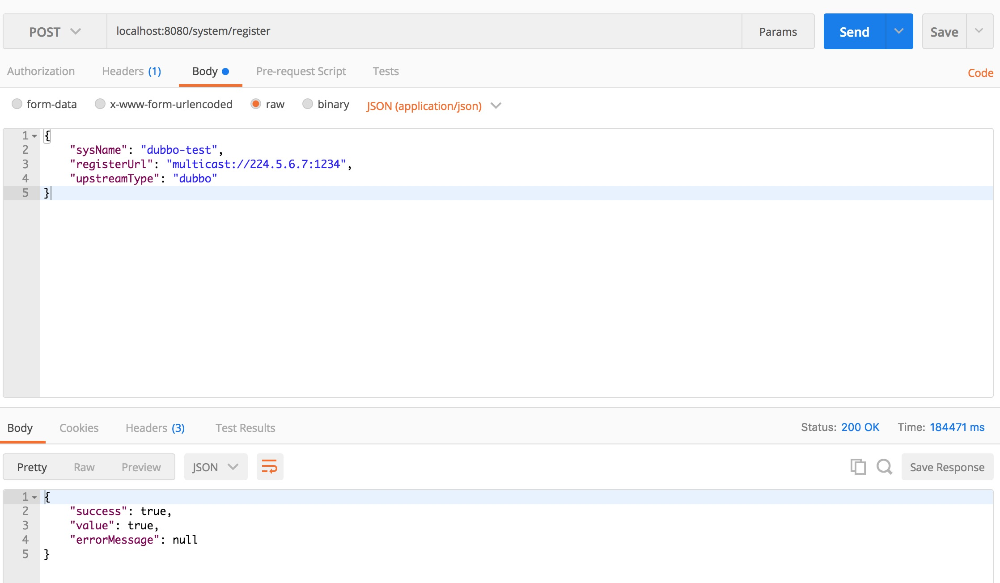
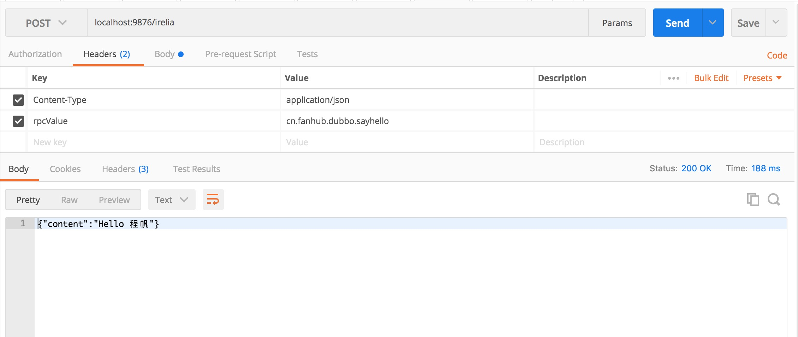

# Placidium

An implementation of [Irelia](https://github.com/distributed-and-microservice/Irelia)

## 如何使用

1. 先启动 dubbodemo 中的 Starter。该项目是一个使用了 Irelia-spi-dubbo 的项目，发布了如下的 rpc:

```java
public interface DemoService extends Serializable {
    @Rpc(value = "cn.fanhub.dubbo.sayhello", name = "testName", desc = "testDes")
    String sayHello(String name);
}

@Component
public class DemoServiceImpl implements DemoService {
    public String sayHello(String name) {
        return "Hello " + name;
    }
}
```

项目的配置如下:

```java
@Component
@ComponentScan(basePackages = "cn.fanhub.demo.dubbo")
public class Config {
    @Bean(initMethod = "init")
    public DubboStarter dubboStarter() {
        DubboStarter dubboStarter = new DubboStarter();
        dubboStarter.setAppName("dubbo-test");
        dubboStarter.setProtocolPort(20880);
        dubboStarter.setRegistryUrl("multicast://224.5.6.7:1234");
        dubboStarter.setServiceThreads(10);
        return dubboStarter;
    }
}
```

2. 修改 Placidium 配置文件中的数据库配置，创建本地数据库(表不需要创建)

3. 启动 Placidium 项目

该项目是一个 springboot 项目，只提供了基本的注册和调用功能。

- 注册接口: localhost:8080/system/register 该接口由 Placidium 提供

参数信息:

```java
{
	"sysName": "dubbo-test",  // 系统名，和 debbodemo 中 DubboStarter 中配置的 appName 保持一致
	"registerUrl": "multicast://224.5.6.7:1234",// 注册中心，和 debbodemo 中 DubboStarter 中配置的 registryUrl 保持一致
	"upstreamType": "dubbo" // 和 Irelia-upstream-dubbo 中 DubboUpstream.name 方法的返回值保持一致
}
```

- 调用 rpc 接口: localhost:9876/irelia 该接口由 Irelia-server 提供，端口号在 Bootstrap 中配置

参数信息

```java
["程帆"]  // 参数列表数组，视对应的 rpc 参数列表而定。DemoService.sayHello 方法的参数是一个 String，所以传一个 String 即可。
```

http 头设置

```java
Content-Type: application/json
rpcValue: cn.fanhub.dubbo.sayhello  // rpcValue 对应 @Rpc 注解中的 rpcValue。该值要确保全局唯一。最佳实践:  域名.系统名.描述.方法名
```

## 演示

注册系统:



调用接口:


